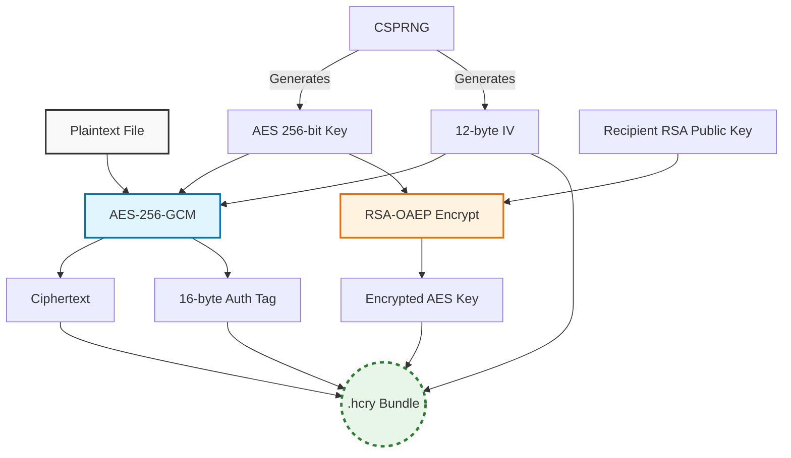
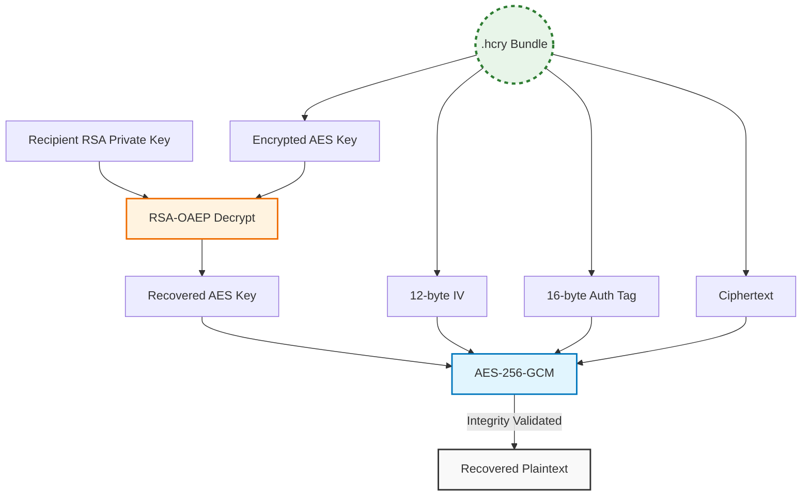

# AstarothCipher

<div align="center">


<br>


</div>

A zero-knowledge, client-side cryptographic engine engineered to provide secure file exchange over untrusted channels. Built with C++ and OpenSSL, and compiled to WebAssembly (WASM), AstarothCipher executes complex cryptographic operations entirely within the browser's local memory heap. 

By eliminating server-side processing, this architecture guarantees that plaintext data and private keys never leave the host machine.

## Cryptographic Architecture: The Hybrid Approach

AstarothCipher implements a Hybrid Cryptography model. Asymmetric cryptography (RSA) is highly secure but computationally expensive and ill-suited for large payloads. Symmetric cryptography (AES) is fast and efficient for large files but presents key-distribution challenges. 

This engine solves both by combining **AES-256-GCM** with **RSA-2048/4096 (OAEP Padding)**:
1. A unique, cryptographically secure 256-bit AES session key is generated for every file.
2. The file is encrypted using AES-256 in Galois/Counter Mode (GCM), providing both confidentiality and authenticated ciphertext integrity.
3. The AES session key is then asymmetrically encrypted using the recipient's RSA Public Key.
4. The encrypted AES key, AES Initialization Vector (IV), GCM Authentication Tag, and the ciphertext are packaged into a binary `.hcry` bundle.

### Protocol Flow: Encryption Phase (Sender)



### Protocol Flow: Decryption Phase (Recipient)



## Core Engineering Features

### 1. WebAssembly Memory Isolation

The cryptographic core is written in C++17 and compiled via Emscripten. The engine operates entirely without a virtual filesystem (!SYSCALLS_REQUIRE_FILESYSTEM), utilizing OpenSSL Memory BIOs (BIO_s_mem) to parse keys and output data. This enforces a strict memory-bound environment, immune to local file-system probing.


### 2. Secure Memory Allocation

Cryptographic operations utilize a custom C++ memory allocator (SecureAllocator). Upon deallocation or scope exit, the allocator invokes OPENSSL_cleanse() to deterministically overwrite the memory buffers with zeroes, preventing cold-boot attacks and memory scraping of residual plaintext or private keys from the WASM heap.


### 3. Native Pointer-to-JS Array Bridging

To bypass browser restrictions on TextDecoder reading from resizable WebAssembly memory bounds (ALLOW_MEMORY_GROWTH=1), the engine utilizes a custom bridge via emscripten::val. Raw C++ bytes are deeply copied into isolated JavaScript Uint8Array views before being decoded, ensuring strict thread-safety and cross-browser compatibility.


### 4. Authenticated Encryption (AEAD)

AES-GCM is utilized to provide Authenticated Encryption with Associated Data. During the decryption pipeline, the engine verifies the 128-bit authentication tag before releasing the plaintext buffer. If the .hcry bundle was tampered with by a single byte during network transit, the decryption deterministically aborts.


## Project Structure

```
AstarothCipher/
├── CMakeLists.txt
├── LICENSE
├── README.md
├── include/
│   ├── aes_gcm.h          # AES-256-GCM interface definitions
│   ├── hybrid.h           # Hybrid encryption protocol structures
│   ├── rsa_keys.h         # RSA keypair management and serialization
│   └── secure_alloc.h     # RAII memory zeroing allocator
├── src/
│   ├── aes_gcm.cpp        # Symmetric cryptography implementation
│   ├── hybrid.cpp         # Bundle serialization & protocol logic
│   ├── rsa_keys.cpp       # OpenSSL EVP asymmetric logic
│   └── wasm_wrapper.cpp   # Embind JS-to-C++ interface bindings
├── public/
│   ├── index.html         # Single-page application interface
│   ├── crypto_engine.js   # Generated WASM glue code
│   └── crypto_engine.wasm # Compiled cryptographic core
└── README.md
```

---

## Security Design

| Layer | Choice | Why |
|-------|--------|-----|
| Symmetric cipher | AES-256-GCM | Encrypts + authenticates in one pass. Any tampered byte is detected. |
| Asymmetric cipher | RSA-4096 | Strongest standard RSA size. Future-proof through 2030+. |
| RSA padding | OAEP + SHA-256 | Provably secure. Immune to Bleichenbacher / ROBOT attacks. |
| Integrity | GCM 128-bit auth tag | One flipped bit anywhere → decryption throws immediately. |
| Key/IV generation | OpenSSL `RAND_bytes` | OS entropy pool (`/dev/urandom`). Return value checked. |

---

## How To Use

Directly go the website [AstarothCipher](https://astarothcipher.vercel.app)


## If You Want To Build It Locally

### Prerequisites For Building

### Ubuntu / Debian
```bash
sudo apt-get update
sudo apt-get install -y build-essential cmake libssl-dev
```

### Fedora / RHEL / CentOS
```bash
sudo dnf install -y gcc-c++ cmake openssl-devel
```

### macOS (Homebrew)
```bash
brew install cmake openssl
export PKG_CONFIG_PATH="/usr/local/opt/openssl/lib/pkgconfig"
```

### Windows (vcpkg)
```bash
vcpkg install openssl
cmake .. -DCMAKE_TOOLCHAIN_FILE=path/to/vcpkg/scripts/buildsystems/vcpkg.cmake
```

Minimum versions required: **CMake 3.16**, **OpenSSL 1.1+**, **C++17** compiler.

---

## Building With Cmake

### Quick build
```bash
mkdir build && cd build
cmake ..
make -j$(nproc)
```

### Build with specific options
```bash
# Release build (optimised, no debug symbols)
cmake .. -DCMAKE_BUILD_TYPE=Release
make -j$(nproc)

# Debug build (default — includes debug symbols)
cmake .. -DCMAKE_BUILD_TYPE=Debug
make -j$(nproc)

# Verbose output (see every compiler command)
make VERBOSE=1
```

### Clean builds
```bash
# Remove compiled objects and binaries only (keeps CMake cache)
make clean

# Full clean — remove everything CMake generated
cd ..
rm -rf build

# Then rebuild from scratch
mkdir build && cd build
cmake ..
make -j$(nproc)
```

After a successful build, the `build/` directory contains:
```
build/
├── hybrid_crypto     ← main CLI binary
├── test_rsa          ← RSA unit tests
├── test_aes          ← AES-GCM unit tests
├── test_hybrid       ← hybrid integration tests
└── test_folder       ← folder encryption tests
```

---

## Running the Tests

### Run all tests
```bash
cd build
ctest --output-on-failure
```

### Run individual test suites
```bash
./test_rsa       # RSA key gen, PEM save/load, OAEP round-trip, passphrase — 13 tests
./test_aes       # AES-GCM encrypt/decrypt, tamper detection, large data  — 17 tests
./test_hybrid    # Full pipeline, file I/O, bundle serialisation           — 28 tests
./test_folder    # Folder pack/unpack, nested dirs, binary files           — 17 tests
```

Expected output for all suites:
```
100% tests passed, 0 tests failed out of 4
```

> **Note:** OpenSSL error lines printed during wrong-key or wrong-passphrase tests are intentional — they prove rejection is working correctly.

---

## Usage

All commands are run from inside the `build/` directory.

### Step 1 — Generate a key pair (do this once)

```bash
# Generate RSA-4096 key pair (default — recommended for production)
./hybrid_crypto genkeys private.pem public.pem

# Generate with a specific key size
./hybrid_crypto genkeys private.pem public.pem --bits 4096   # strongest
./hybrid_crypto genkeys private.pem public.pem --bits 3072   # NIST recommended
./hybrid_crypto genkeys private.pem public.pem --bits 2048   # minimum acceptable
```

Output:
```
Generating RSA-4096 key pair...
  Private key -> private.pem
  Public  key -> public.pem
Done.
```

Keep `private.pem` secret. Share `public.pem` with anyone who needs to encrypt data for you.

---

### Step 2 — Encrypt a file

```bash
./hybrid_crypto encrypt <input-file> <output.hcry> <public.pem>
```

Examples:
```bash
# Text file
./hybrid_crypto encrypt secret.txt         secret.hcry       public.pem

# PDF document
./hybrid_crypto encrypt report.pdf         report.hcry       public.pem

# Image
./hybrid_crypto encrypt photo.jpg          photo.hcry        public.pem

# Video
./hybrid_crypto encrypt movie.mp4          movie.hcry        public.pem

# Archive
./hybrid_crypto encrypt backup.zip         backup.hcry       public.pem

# Database dump
./hybrid_crypto encrypt database.sql       database.hcry     public.pem

# Any binary
./hybrid_crypto encrypt firmware.bin       firmware.hcry     public.pem
```

---

### Step 3 — Decrypt a file

```bash
./hybrid_crypto decrypt <input.hcry> <output-file> <private.pem>
```

Examples:
```bash
./hybrid_crypto decrypt secret.hcry        recovered.txt     private.pem
./hybrid_crypto decrypt report.hcry        report.pdf        private.pem
./hybrid_crypto decrypt photo.hcry         photo.jpg         private.pem
./hybrid_crypto decrypt movie.hcry         movie.mp4         private.pem
```

---

### Encrypt a folder 

Packs the entire folder tree into a single encrypted `.hcry` bundle. All subdirectories, file names, and relative paths are preserved.

```bash
./hybrid_crypto encrypt-folder <folder/> <output.hcry> <public.pem>
```

Examples:
```bash
# A project directory
./hybrid_crypto encrypt-folder my_project/       my_project.hcry      public.pem

# Documents folder
./hybrid_crypto encrypt-folder ~/Documents/      documents.hcry       public.pem

# Configuration files
./hybrid_crypto encrypt-folder config/           config.hcry          public.pem

# Source code
./hybrid_crypto encrypt-folder src/              src_backup.hcry      public.pem
```

Output:
```
Packing folder: my_project/
  + main.cpp (1420 bytes)
  + include/utils.h (340 bytes)
  + data/config.json (88 bytes)
  Packed 3 files (1848 bytes total)
Encrypting archive...
Folder bundle saved to: my_project.hcry
Done.
```

---

### Decrypt a folder

Recreates the original directory tree inside the specified output directory.

```bash
./hybrid_crypto decrypt-folder <input.hcry> <output-folder/> <private.pem>
```

Examples:
```bash
./hybrid_crypto decrypt-folder my_project.hcry   my_project_recovered/   private.pem
./hybrid_crypto decrypt-folder documents.hcry    documents_recovered/    private.pem
./hybrid_crypto decrypt-folder config.hcry       config_restored/        private.pem
```

Output:
```
Decrypting archive...
Unpacking to: my_project_recovered/
  -> main.cpp (1420 bytes)
  -> include/utils.h (340 bytes)
  -> data/config.json (88 bytes)
  Unpacked 3 files
Done.
```

Verify the recovered folder is identical to the original:
```bash
diff -r my_project/ my_project_recovered/ && echo "PERFECT MATCH ✓"
```


## Production WASM Build (WebAssembly)

Use this method to generate the crypto_engine.js and crypto_engine.wasm files required for your web dashboard. This command invokes the Emscripten compiler and links against your WASM-compiled OpenSSL dependencies.

```bash
#From the root
# 1. Clear previous build artifacts
rm public/crypto_engine.js public/crypto_engine.wasm

# 2. Execute Emscripten compiler
emcc src/rsa_keys.cpp src/aes_gcm.cpp src/hybrid.cpp src/wasm_wrapper.cpp \
  -o public/crypto_engine.js \
  -std=c++17 \
  -I./include -I/path/to/wasm_deps/openssl-3.3.1/wasm_build/include \
  -L/path/to/wasm_deps/openssl-3.3.1/wasm_build/lib \
  -lcrypto -lembind -O3 \
  -s ALLOW_MEMORY_GROWTH=1 \
  -s ASSERTIONS=1 \
  -s DISABLE_EXCEPTION_CATCHING=0 \
  -include openssl/pem.h

# 3. Host for browser testing
cd public
python3 -m http.server 8000
```


---

## Supported File Types

This tool operates on raw bytes — it supports **every file type** without exception. There is no parsing or interpretation of file contents.

| Category | Examples |
|----------|---------|
| Documents | `.txt` `.pdf` `.docx` `.xlsx` `.pptx` `.odt` `.md` `.rtf` |
| Images | `.jpg` `.jpeg` `.png` `.gif` `.bmp` `.tiff` `.webp` `.svg` `.raw` |
| Video | `.mp4` `.mkv` `.avi` `.mov` `.wmv` `.flv` `.webm` `.m4v` |
| Audio | `.mp3` `.wav` `.flac` `.aac` `.ogg` `.m4a` `.wma` |
| Archives | `.zip` `.tar` `.gz` `.bz2` `.xz` `.7z` `.rar` |
| Code | `.c` `.cpp` `.h` `.py` `.js` `.ts` `.java` `.go` `.rs` `.sh` |
| Data | `.json` `.xml` `.csv` `.yaml` `.toml` `.sql` `.db` `.sqlite` |
| Executables | `.exe` `.elf` `.dll` `.so` `.dylib` `.bin` |
| Disk images | `.iso` `.img` `.vmdk` `.vdi` `.qcow2` |
| Certificates | `.pem` `.crt` `.key` `.p12` `.pfx` |
| Any binary | Any file with any byte values (0x00–0xFF) — fully supported |

There is no file size limit other than available RAM (the current implementation reads files into memory).

---

## The .hcry Bundle Format

Every encrypted output is a self-contained `.hcry` binary bundle:

```
┌─────────────────────────────────────────────────────────┐
│  4 bytes   │  Magic: "HCRY"                             │
│  1 byte    │  Version: 0x01                             │
│  4 bytes   │  RSA-encrypted AES key length (big-endian) │
│  N bytes   │  RSA-OAEP encrypted AES-256 key            │
│  12 bytes  │  AES-GCM IV (random, unique per file)      │
│  16 bytes  │  AES-GCM authentication tag                │
│  8 bytes   │  Ciphertext length (big-endian)            │
│  M bytes   │  AES-GCM ciphertext                        │
└─────────────────────────────────────────────────────────┘
```

For folder bundles, the ciphertext is a packed archive of all files with their relative paths embedded.

---

## Quick End-to-End Example

```bash
cd build

# 1. Generate keys
./hybrid_crypto genkeys private.pem public.pem

# 2. Create a test file
echo "My secret: password123" > secret.txt

# 3. Encrypt
./hybrid_crypto encrypt secret.txt secret.hcry public.pem

# 4. Confirm it's unreadable
cat secret.hcry         # binary noise — cannot read original content

# 5. Decrypt
./hybrid_crypto decrypt secret.hcry recovered.txt private.pem

# 6. Confirm it matches
diff secret.txt recovered.txt && echo "MATCH ✓"

# 7. Prove wrong key fails
./hybrid_crypto genkeys wrong_priv.pem wrong_pub.pem --bits 2048
./hybrid_crypto decrypt secret.hcry fail.txt wrong_priv.pem
# → Decryption failed. (correct — only the right private key works)
```

---


## License

This repository is under MIT License. Feel free to modify and use it!